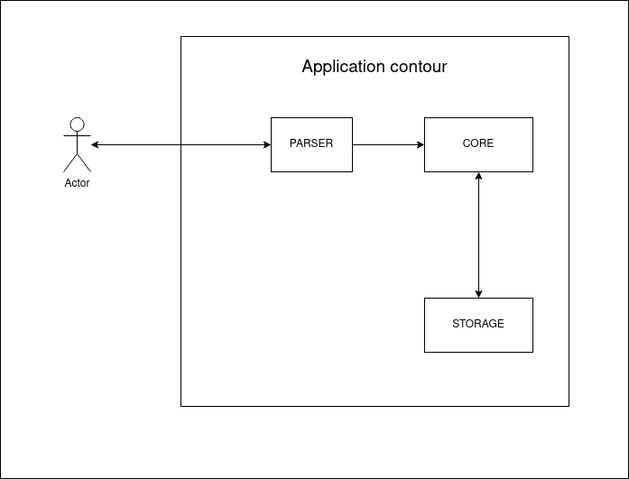

## TEAM TRITIUM
* Романченко Дмитрий (ФИ-92)
* Панасюк Егор (ФИ-94)

--------------------------
## Main Task
Варіант №7: Реляційна модель із фільтрацією довільної складності

--------------------------
## Architecture

--------------------------
## Progress & Deadlines
* Parser realization (11.10)
* Commands `CREATE`, `SELECT`, `WHERE` ( simple CORE ), unit-testing  (15.11.2021)
* Command `WHERE' with full functionality ( advanced CORE ), 80%+ coverage with tests (12.12.2021)
